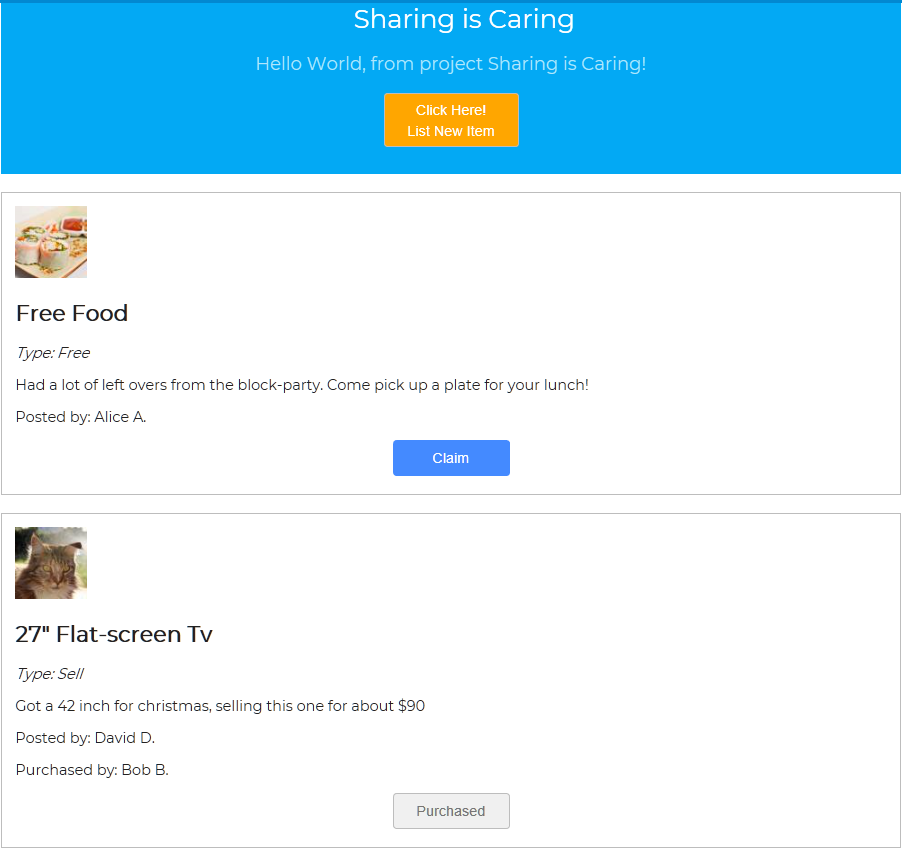
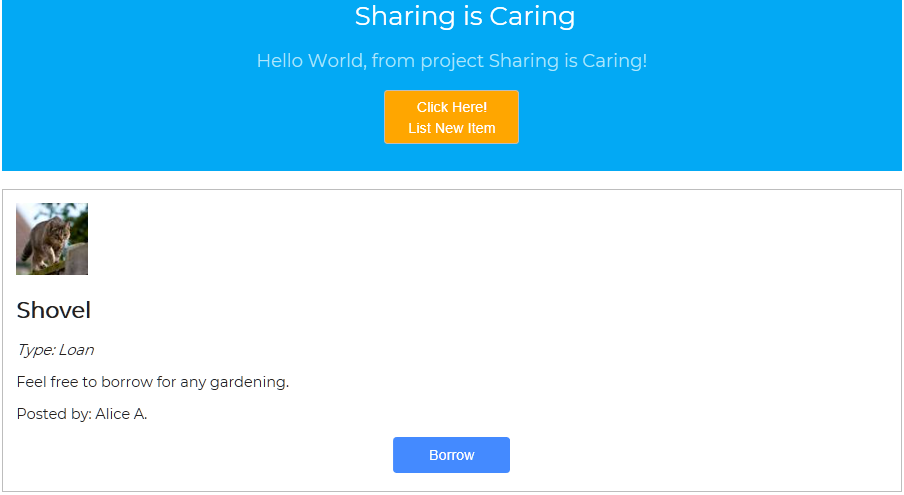
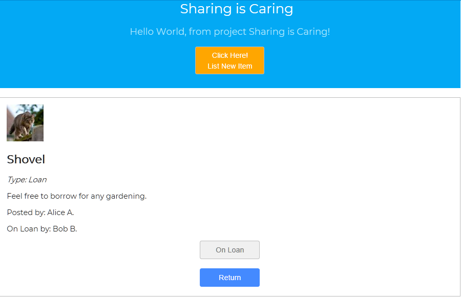
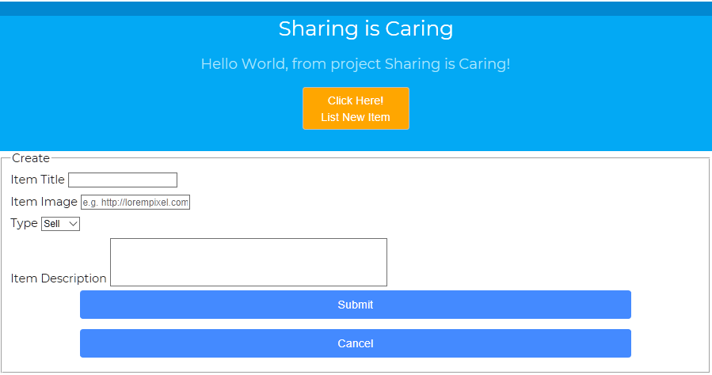
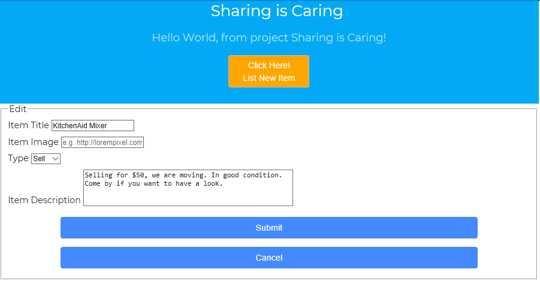
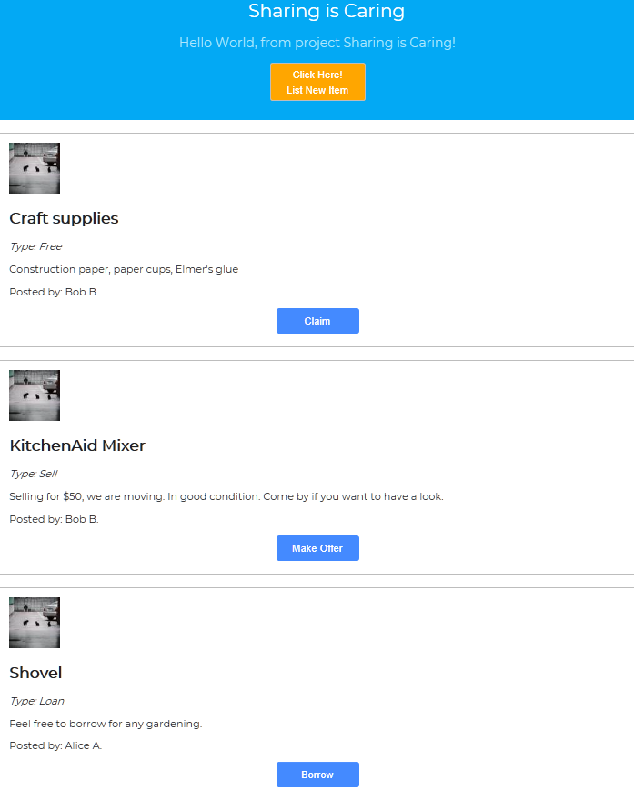

<h1 align="center">
  <br>
  Sharing is Caring
  <br>
</h1>

<h4 align="center">Connecting you locally one small step at a time.</h4>

<p align="center">
    <a href="#key-features">Key Features</a> •
    <a href="#setup">Setup</a> •
    <a href="#usage">Usage</a> •
    <a href="#screenshots">Screenshots</a> •
    <a href="#documentation">Documentation</a> •
    <a href="#history">History</a> •
    <a href="#technology-stack-credits">Technology Stack Credits</a> •
</p>

<p align="center">
    <a href="https://travis-ci.org/thinkful-ei17/node-capstone-abraham-linda">
        
    </a>
</p>   

---
Online resource where members of a given community can loan, give away or sell their items all while encouraging interaction to get to know your neighbors.



---
## Key Features
+ Share items by offering them up for loan
+ Give away any item to those who need it
+ Sell your items to make an extra buck or support local community charities
+ Borrow a needed item from available community resources
    - Check in avaialble community resources
    - Check out available community resources
+ Add a new item
    - Submit a new item
    - Cancel option to list new item
+ Edit an existing item you list
    - Submit edits made to an existing item
    - Cancel option to edit
+ Delete an existing item you list
+ Choose to borrow an item, claim a free item, or purchase an item 

---
## Setup

To clone and run this application, you'll need [Git](https://git-scm.com), [Node.js](https://nodejs.org/en/download/) (which comes with [npm](http://npmjs.com)), [MongoDB](https://www.mongodb.com/download-center#atlas) installed on your computer. 

From your command line:

```bash
# Clone this repository
$ git clone https://github.com/thinkful-ei17/node-capstone-abraham-linda

# Go into the repository
$ cd node-capston-abraham-linda

# Install dependencies
$ npm install

# Run mongod instance on localhost (Seperate Terminal)
$ mongod

# Seed data locally
$ mongoimport --db sharing-is-caring --collection items --drop --file ~/items/v1/primer.itemdataset.json

# Run the app
$ npm start
```
---
## Usage
After you clone this repo to your desktop, go to its root directory and run npm install to install its dependencies.

Once the dependencies are installed, run an instance of mongod and seed data locally. Then, you can run npm start to start the application. You will be able to access it at localhost:8080

---
## Screenshots
<h3 align="center">
  <br>
  Borrow item
  <br>
</h3>



<h3 align="center">
  <br>
  Return item
  <br>
</h3>



<h3 align="center">
  <br>
  Add item
  <br>
</h3>



<h3 align="center">
  <br>
  Edit item
  <br>
</h3>



<h3 align="center">
  <br>
  Delete item
  <br>
</h3>


<h3 align="center">
  <br>
  Borrow/Buy/Claim item
  <br>
</h3>



---
## Documentation
#### Model

* `item` The Item object models the resources in the Items database for REST API.
  * `name` {string} Name of item posted
  * `image` {string} Display icon of image provided by user or default to random icon.
  * `type` {string} Designate what type of transaction category. Either `'Sell'`, `'Loan'`, or `'Free'`.
  * `description` {string} Description of item posted
  * `postedBy` {string} Capture the user who posted the item
  * `acceptedBy` {string} Capture the user who receives the item 
  * `type` {string} Designate what type of transaction sub-category. Either `'Make Offer'`, `'Purchased'`, `'Claim'`, `'Claimed'`, `'Borrow'`, or `'On Loan'`.

#### Events

* `welcome` When a user acceses the application.
* `create` When a user wants to create an item.
* `addItem` When a user creates an item.
* `cancelOption` When a user chooses to not create an item or edit an item.
* `edit` When a user wants to edit an item.
* `editItem` When a user edits an item.
* `claimItem` When a user wants to receive an item.
* `returnItem` When a user wants to check-in (return) an item.
* `delete` When a user deletes an item.

#### REST API

* `welcome()`Loads application 
* `listItems()`Gets all the items in the Items database
* `listItem(id)` Gets an item in the Items database by id
* `createItem(newItem)` Creates a new item to the Items database
* `editItem(editedDocument)` Updates an existing item in the Items database
* `claimItem(claimDocument)` Updates an existing item in the Items database to designate the recipient of an item
* `returnItem(returnDocument)` Updates an existing item in the Items database to remove the recipient of an item and make item available again
* `deleteItem(id)` Deletes an existing item in the Items database

---
## History
* 0.11.0 - Update README
* 0.10.0 - Add landing page for demo
* 0.9.0 - Update tests to include return, edit and claim functionality
* 0.8.1 - Add additional css styling to buttons
* 0.8.0 - Add additional css styling to list, create, and edit page
* 0.7.1 - Fix race condition of action buttons
* 0.7.0 - Add button functionality for returning items
* 0.6.0 - Add sort by descending for items listing
* 0.5.4 - Add button functionality for claiming items
* 0.4.0 - Update tests for CRUD
* 0.3.0 - Update images field to use provided image link or placeholder
* 0.2.0 - Fix `next` issue
* 0.1.0 - Initial release

---
## Technology Stack Credits
This software uses code from several open source packages.

Front-end technologies
+ ES6 JavaScript
+ [jQuery](https://jquery.com/)
+ CSS media queries

Server technologies
+ [Express](http://expressjs.com/)
+ [bcryptjs](https://www.npmjs.com/package/bcryptjs)
+ [jsonwebtoken](https://jwt.io/)
+ [passport.js](http://www.passportjs.org/)

Data Persistence
+ [MongoDB](https://www.mongodb.com/)
+ [Mongoose](http://mongoosejs.com/)

​Hosting/SaaS
+ [Heroku](https://dashboard.heroku.com/)
+ [MLab](https://mlab.com/)

Development Environment
+ Continuous Integration and Deployment
    - [Travis CI](https://travis-ci.org/) / [Heroku](https://dashboard.heroku.com/)
+ [Github](https://github.com/) (branching, pull requests, merging)
+ [VS Code](https://code.visualstudio.com/)
+ [Node.js](https://nodejs.org/) Libraries
    - [Mocha.js](https://mochajs.org/)
    - [Chai / Chai HTTP](http://chaijs.com/)
    - [Nodemon](https://nodemon.io/)
    - [faker](https://www.npmjs.com/package/Faker)
    - [dotenv](https://www.npmjs.com/package/dotenv)

---
